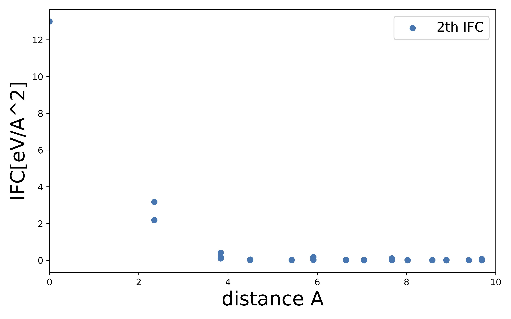
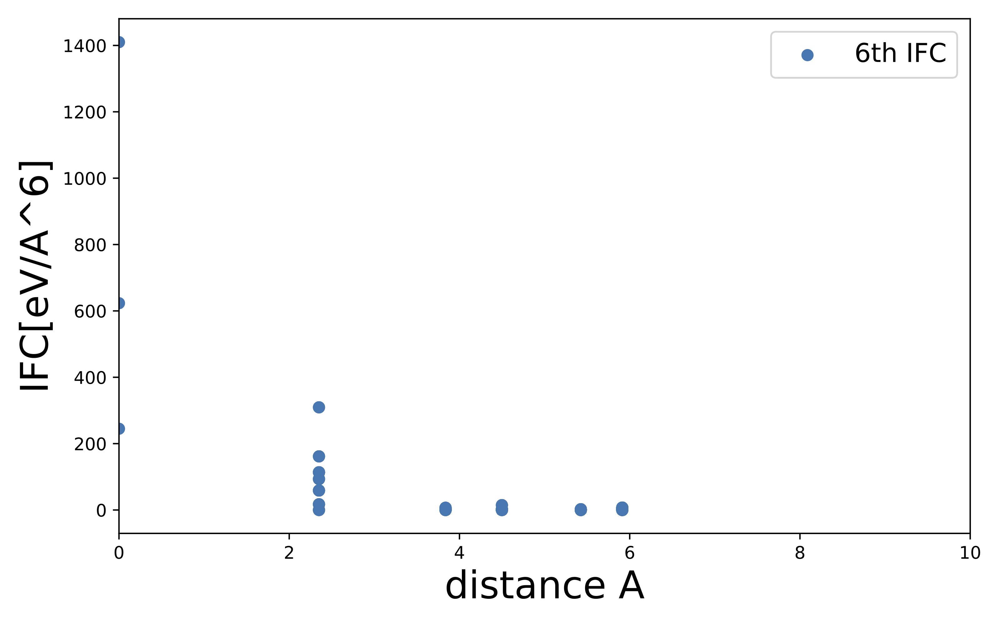

# smallcodes_ALAMODE

## Introduction

`smallcodes_ALAMODE` includes several usefull python scripts for ALAMODE, which is anharmonic phonon calculator. Below are the list of codes.

- plot_ifc.py : plotting atomic distances vs IFCs from ALAMODE ifc files(.fcs) to check if IFCs are converged with respect to atomic distances.
- calc_pes.py : calculating potential energy surface from ALAMODE ifc files(.xml).
- plot_ltc.py : plotting Lattice Thermal Conductivity from ALAMODE *.kl files.

## Requirements

Following python modules are required.

- ase
- xml
- matplotlib

## Examples ( see also sample/)

### plot_ifc.py

### calc_pes.py
### plot_ltc.py

